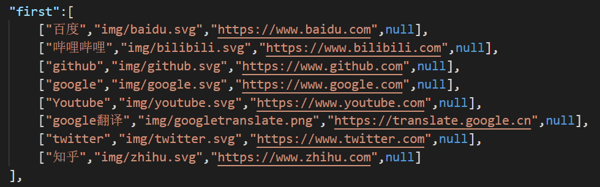
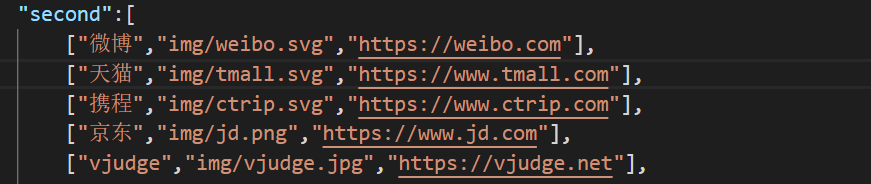
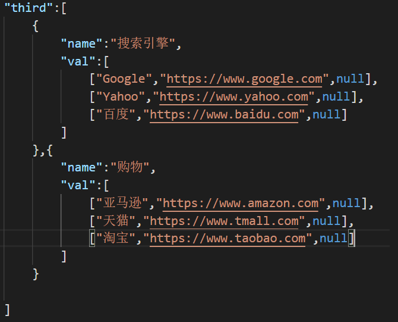

# bobo-navigation
hello world!  
这个是一个导航网站的模板  
极简主义的主页，既简单又美观，快来试试吧  
网站预览：[www.aliubo.com/nav](http://www.aliubo.com/nav)  

# 操作方法
1. 下载仓库并解压，若自定义内容的话需要修改```nav.json```文件，打开  
2. "first"是首要图标的配置，数组大小推荐为8的倍数，以显示整洁美观  
   成员内容：[string:标题, string:图标地址, string:链接地址, string:背景颜色]  
   背景颜色为非必填，缺省为null  
   内容可参考下图所示  
     
3. "second"是第二级图标的配置，数组大小推荐为6的倍数，以显示整洁美观  
   成员内容：[string:标题, string:图标地址, string:链接地址]  
   内容可参考下图所示  
     
4. "third"是第三级图标的配置，数组大小推荐为3的倍数，以显示整洁美观  
   成员内容：{"name":string->分类名称, "val":Array->图标集（推荐9个成员）}  
       val成员内容：[string:标题, string:链接地址, string:文本颜色]  
       文本颜色为非必填，缺省为null  
       内容可参考下图所示  
         


感谢您的浏览    
